# Architecture Documentation

This document provides a detailed technical overview of the dox document engineering toolkit architecture.

## System Overview

dox is a client-side document conversion pipeline that transforms markdown content into styled DOCX files using design tokens extracted from Word templates.

## High-Level Architecture

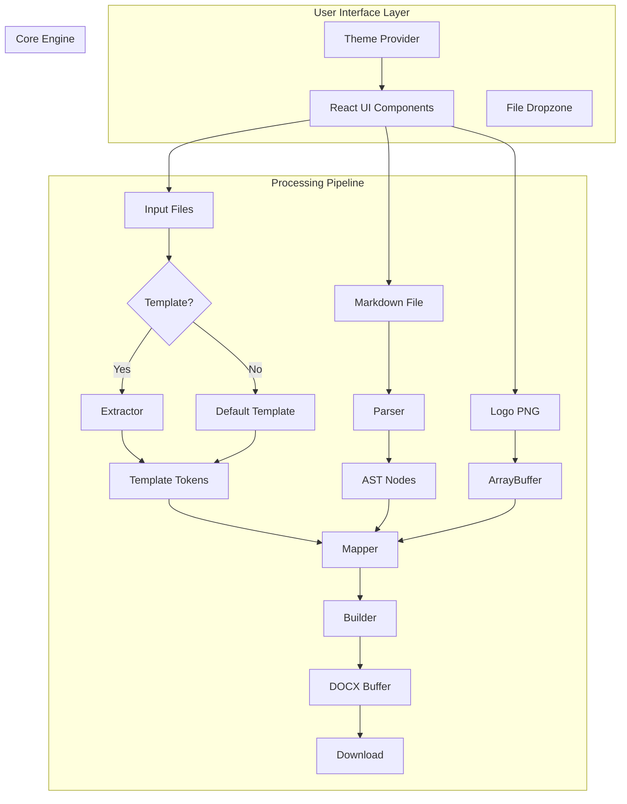

## Component Architecture

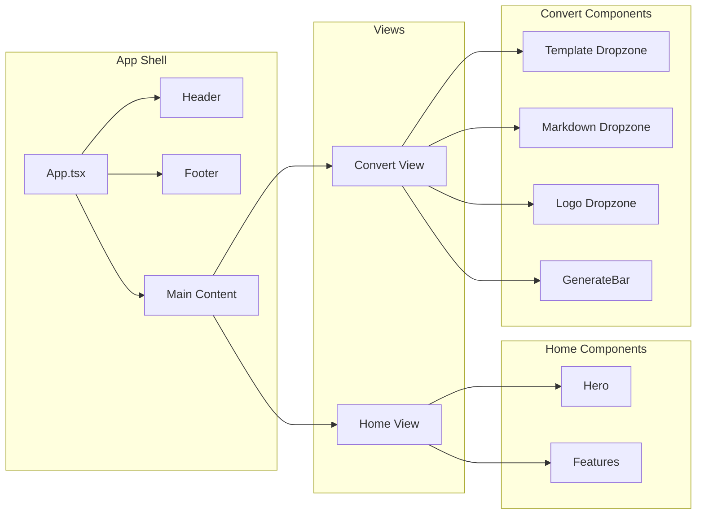

## Data Flow Diagram

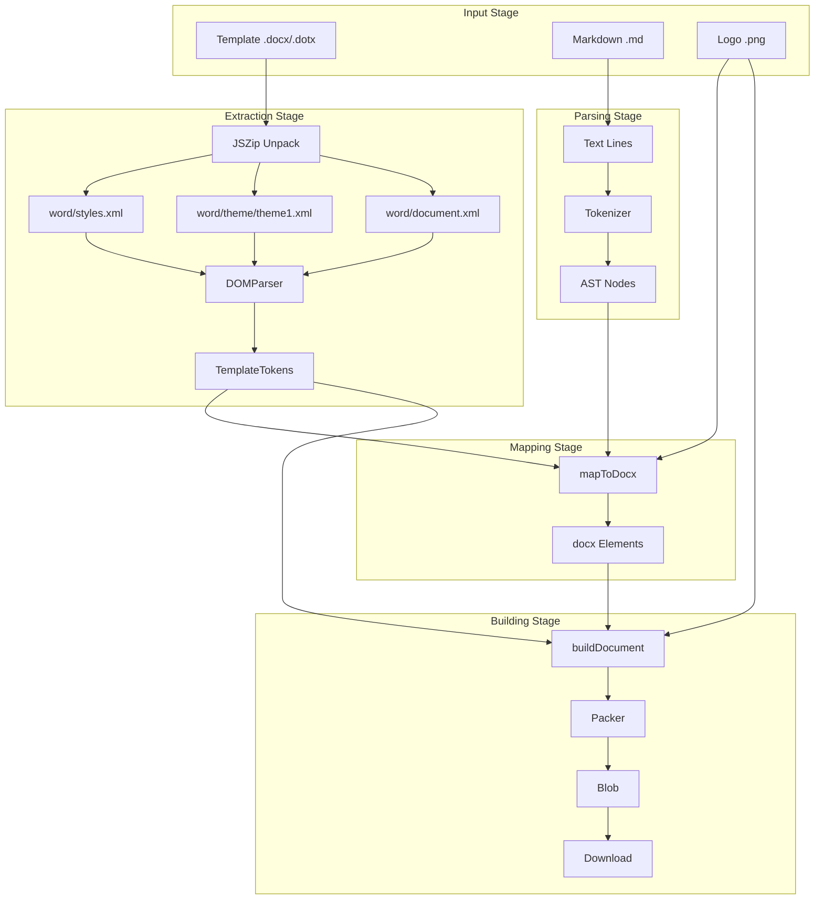

## Engine Module Sequence

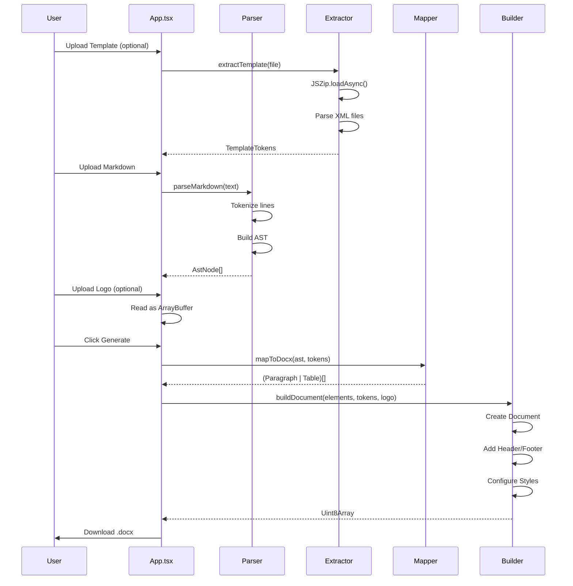

## Type System

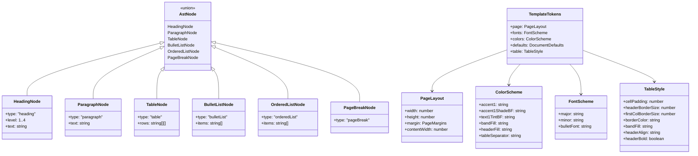

## Module Dependencies

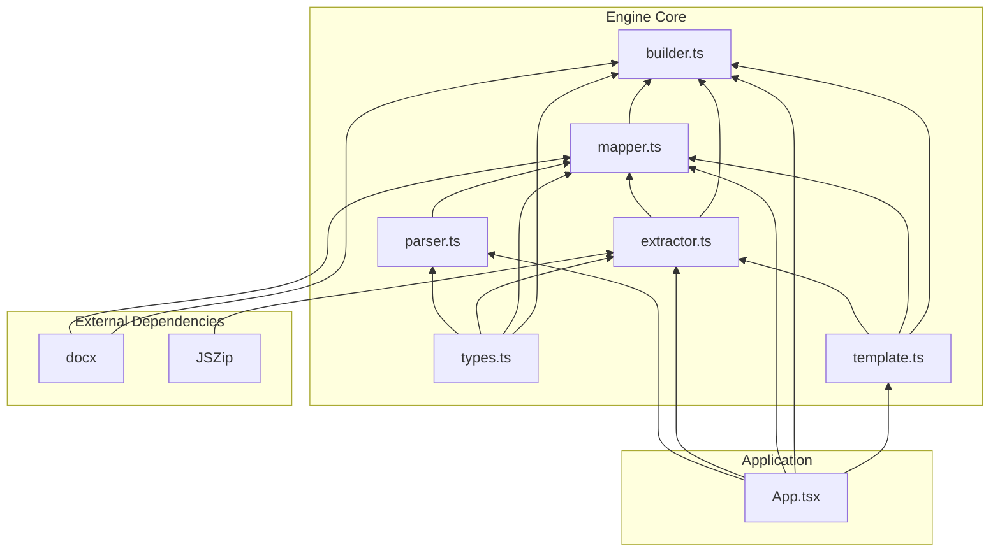

## State Management

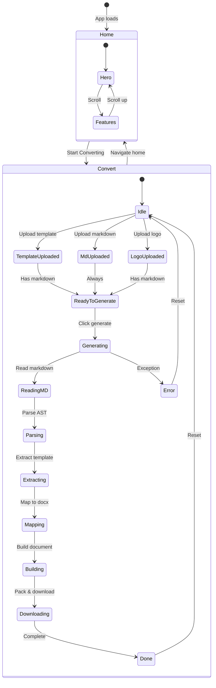

## File Processing Pipeline

### Template Extraction

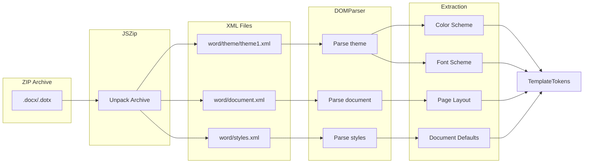

### Markdown Parsing

```mermaid
flowchart TD
    subgraph "Input"
        MD[Markdown Text]
    end

    subgraph "Line Processing"
        SPLIT[Split by newlines]
        ITER[Iterate lines]
    end

    subgraph "Pattern Matching"
        HEADING{Heading?}
        TABLE{Table?}
        BULLET{Bullet list?}
        ORDERED{Ordered list?}
        BREAK{Page break?}
        PARA{Paragraph}
    end

    subgraph "AST Nodes"
        HNODE[HeadingNode]
        TNODE[TableNode]
        BNODE[BulletListNode]
        ONODE[OrderedListNode]
        PBNODE[PageBreakNode]
        PNODE[ParagraphNode]
    end

    MD --> SPLIT --> ITER
    ITER --> HEADING
    HEADING -->|Yes| HNODE
    HEADING -->|No| TABLE
    TABLE -->|Yes| TNODE
    TABLE -->|No| BULLET
    BULLET -->|Yes| BNODE
    BULLET -->|No| ORDERED
    ORDERED -->|Yes| ONODE
    ORDERED -->|No| BREAK
    BREAK -->|Yes| PBNODE
    BREAK -->|No| PARA
    PARA --> PNODE

    HNODE & TNODE & BNODE & ONODE & PBNODE & PNODE --> AST[AstNode[]]
```

## Styling System

### CSS Architecture

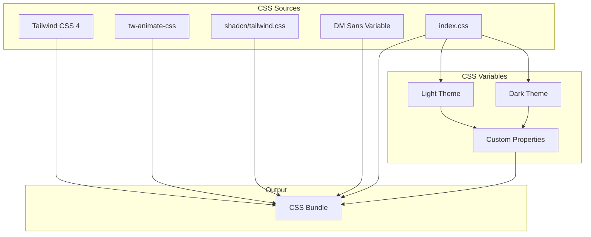

### Theme System

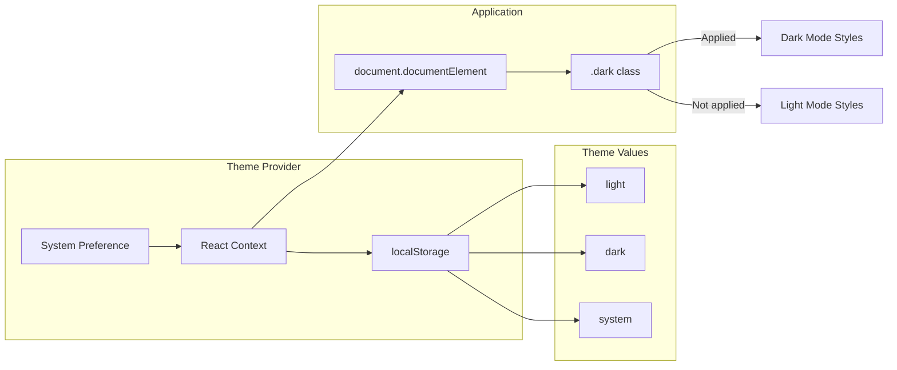

## Deployment Architecture

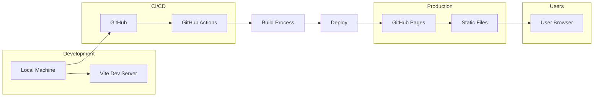

## Performance Considerations

### Code Splitting

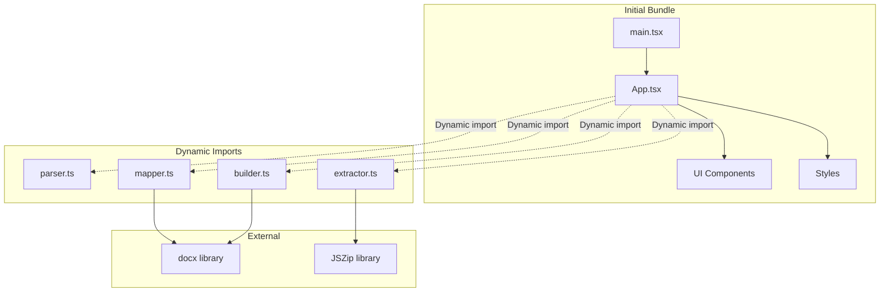

### Bundle Size Optimization

| Strategy | Implementation |
|----------|----------------|
| Dynamic Imports | Engine modules loaded on-demand |
| Tree Shaking | Vite automatic optimization |
| CSS Purging | Tailwind CSS 4 built-in |
| Minification | Vite production build |

## Security Model

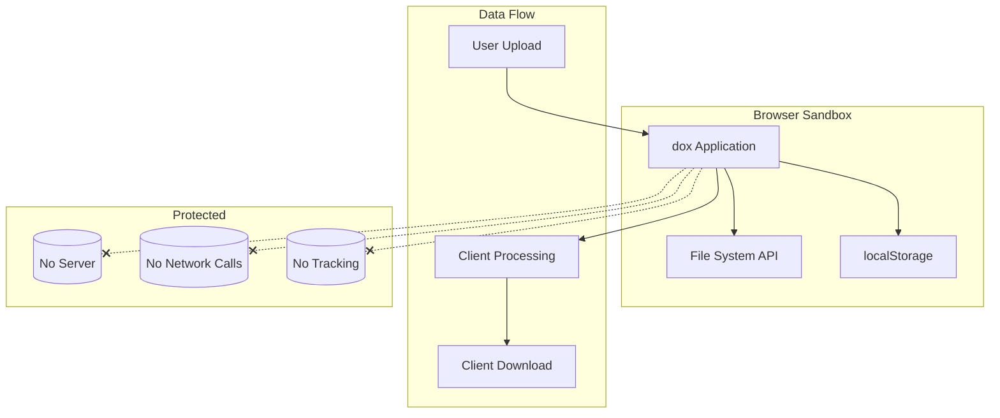

## Error Handling

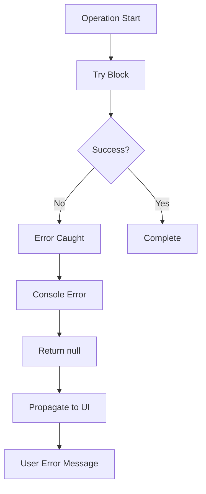

---

**Next:** [API Reference](./api-reference.md) | [User Guide](./user-guide.md)
