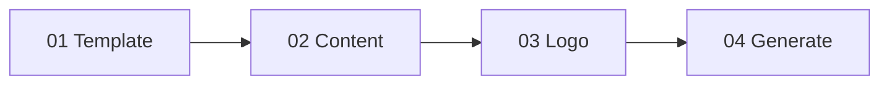

# User Guide

This guide will help you get started with dox and create production-grade DOCX documents from markdown.

## Table of Contents

- [Getting Started](#getting-started)
- [The Conversion Workflow](#the-conversion-workbook)
- [Markdown Syntax Reference](#markdown-syntax-reference)
- [Template Extraction](#template-extraction)
- [Common Use Cases](#common-use-cases)
- [Troubleshooting](#troubleshooting)
- [FAQ](#faq)

---

## Getting Started

### Access the Application

1. Open your web browser
2. Navigate to the dox application URL
3. The home page displays the main features and a "Start Converting" button

### System Requirements

- **Browser:** Chrome 90+, Firefox 90+, Safari 14+, or Edge 90+
- **JavaScript:** Must be enabled
- **Files:** Access to local .md, .docx/.dotx, and .png files

### Interface Overview

The application has two main views:

| View | Description |
|------|-------------|
| **Home** | Landing page with feature overview and workflow preview |
| **Convert** | Document conversion interface with file upload zones |

---

## The Conversion Workflow

The conversion process follows four steps:



### Step 1: Template (Optional)

Upload a Word document to extract its design system.

**Supported formats:**

- `.docx` - Word Document
- `.dotx` - Word Template

**What gets extracted:**

- Font families (headings and body text)
- Colors (accent colors, text colors)
- Page layout (margins, size)
- Table styles (borders, banding)

**If skipped:**
The default EcoSol RFP-SWMS style is applied.

### Step 2: Content (Required)

Upload your markdown file with the document content.

**Supported format:**

- `.md` - Markdown file

**Required elements:**

- At least one paragraph or heading

### Step 3: Logo (Optional)

Upload a PNG logo for the document header.

**Supported format:**

- `.png` - PNG image

**Placement:**

- Right-aligned in the header
- Scaled to 152×71 pixels

### Step 4: Generate

Click "Generate .docx" to create your document.

The generated file will download automatically with the same name as your markdown file, but with a `.docx` extension.

---

## Markdown Syntax Reference

### Headings

```markdown
# Heading 1 (Title)
## Heading 2 (Section)
### Heading 3 (Subsection)
#### Heading 4 (Minor heading)
```

**Styling:**

| Level | Style |
|-------|-------|
| H1 | 72pt, All Caps, Dark |
| H2 | 36pt, All Caps |
| H3 | 28pt, All Caps |
| H4 | 28pt, Small Caps |

### Paragraphs

```markdown
This is a normal paragraph.

This is another paragraph.
Separate paragraphs with blank lines.
```

### Text Formatting

```markdown
**bold text**
*italic text*
`inline code`
```

### Bullet Lists

```markdown
- First item
- Second item
- Third item
```

### Numbered Lists

```markdown
1. First step
2. Second step
3. Third step
```

### Tables

```markdown
| Header 1 | Header 2 | Header 3 |
|----------|----------|----------|
| Cell 1   | Cell 2   | Cell 3   |
| Cell 4   | Cell 5   | Cell 6   |
```

**Table features:**

- Header row with bottom border
- First column with right border
- Alternating row colors (banding)
- Centered header text

### Page Breaks

```markdown
---
```

Use three dashes to create a page break.

### Complete Example

```markdown
# Company Report

## Executive Summary

This report provides an overview of **Q4 performance** and *key metrics*.

## Key Findings

1. Revenue increased by 15%
2. Customer satisfaction improved
3. New markets expanded

## Data Overview

| Metric    | Q3     | Q4     | Change |
|-----------|--------|--------|--------|
| Revenue   | $1.2M  | $1.4M  | +15%   |
| Users     | 10,000 | 12,500 | +25%   |

## Action Items

- Review marketing strategy
- Update sales targets
- Plan Q1 initiatives

---

# Appendix

Additional data and references.
```

---

## Template Extraction

### Creating a Custom Template

1. **Open Microsoft Word** (or compatible application)

2. **Design your document:**
   - Set page margins (Layout → Margins)
   - Choose fonts (Home → Font)
   - Define colors (Design → Colors)
   - Create table styles

3. **Save as template:**
   - File → Save As
   - Select `.dotx` (Template) or `.docx` (Document)

4. **Upload to dox:**
   - Use the template dropzone in the Convert view

### What Affects Output

| Template Element | Output Effect |
|------------------|---------------|
| Theme Colors | Accent colors, table borders |
| Theme Fonts | Heading and body fonts |
| Page Margins | Document margins |
| Default Font Size | Body text size |

### Template Best Practices

- Use Word's built-in theme system for colors and fonts
- Keep margins within standard ranges (0.5" - 2")
- Use standard page sizes (Letter, A4)
- Test with sample content before production

---

## Common Use Cases

### Business Reports

**Template:** Company branded template
**Content:** Structured markdown with headings and tables
**Logo:** Company logo

```markdown
# Quarterly Business Review

## Financial Performance

| Category  | Budget  | Actual  | Variance |
|-----------|---------|---------|----------|
| Revenue   | $500K   | $525K   | +5%      |
| Expenses  | $300K   | $285K   | -5%      |

## Key Accomplishments

- Launched new product line
- Expanded to 3 new markets
- Hired 15 new team members
```

### Technical Documentation

**Template:** Clean, minimal template
**Content:** Code-heavy markdown with inline code
**Logo:** Optional

```markdown
# API Documentation

## Authentication

All requests require a valid API token.

1. Obtain token from dashboard
2. Include in `Authorization` header
3. Token expires after 24 hours

## Endpoints

| Method | Endpoint      | Description    |
|--------|---------------|----------------|
| GET    | /api/users    | List users     |
| POST   | /api/users    | Create user    |
```

### Proposals

**Template:** Professional proposal template
**Content:** Structured proposal markdown
**Logo:** Company logo

```markdown
# Project Proposal

## Executive Summary

**Project:** Website Redesign
**Client:** Acme Corporation
**Timeline:** 12 weeks

## Scope of Work

1. Discovery and planning
2. Design mockups
3. Development
4. Testing and launch

## Investment

| Phase        | Duration | Cost    |
|--------------|----------|---------|
| Discovery    | 2 weeks  | $5,000  |
| Design       | 4 weeks  | $12,000 |
| Development  | 4 weeks  | $18,000 |
| Launch       | 2 weeks  | $5,000  |
```

---

## Troubleshooting

### Common Issues

#### Document Won't Generate

**Symptom:** "Generate" button disabled or no download

**Solutions:**

1. Ensure a markdown file is uploaded
2. Check that the file has a `.md` extension
3. Verify the markdown file is not empty

#### Styling Doesn't Match Template

**Symptom:** Output differs from template appearance

**Solutions:**

1. Ensure template uses Word's theme system
2. Check that colors are defined in theme (not manual)
3. Verify fonts are installed on your system

#### Table Formatting Issues

**Symptom:** Tables look incorrect in output

**Solutions:**

1. Ensure table syntax is correct (pipes aligned)
2. Avoid empty cells in header row
3. Check for extra spaces in cells

#### Logo Not Appearing

**Symptom:** Logo doesn't show in header

**Solutions:**

1. Verify file is PNG format
2. Check file size (should be under 5MB)
3. Ensure PNG has proper transparency

### Error Messages

| Message | Cause | Solution |
|---------|-------|----------|
| "Error: Invalid file type" | Wrong file format | Use .md, .docx, .dotx, or .png |
| "Error: Extraction failed" | Corrupt template | Try a different .docx file |
| "Error: Parsing failed" | Invalid markdown | Check markdown syntax |

---

## FAQ

### General

**Q: Is my data sent to a server?**
A: No. All processing happens in your browser. Your files never leave your device.

**Q: What browsers are supported?**
A: Chrome 90+, Firefox 90+, Safari 14+, and Edge 90+.

**Q: Is there a file size limit?**
A: There's no hard limit, but files over 10MB may be slow to process.

### Templates

**Q: Can I use any Word document as a template?**
A: Yes, but documents using Word's theme system produce the best results.

**Q: What if I don't have a template?**
A: A default professional style is applied automatically.

**Q: Can I save templates for reuse?**
A: The current version doesn't support template storage. Keep your .dotx files locally.

### Markdown

**Q: Can I use images in markdown?**
A: Image syntax is not supported. Use the logo upload for header images.

**Q: Are footnotes supported?**
A: No, footnotes are not currently supported.

**Q: Can I use HTML in markdown?**
A: No, HTML tags are rendered as plain text.

### Output

**Q: What format is the output?**
A: DOCX format (Office Open XML), compatible with Word, Google Docs, and LibreOffice.

**Q: Can I edit the output document?**
A: Yes, the output is a fully editable Word document.

**Q: Are headers and footers customizable?**
A: Headers include the logo (if uploaded) and a tagline. Footers include page numbers.

---

## Keyboard Shortcuts

| Shortcut | Action |
|----------|--------|
| `D` | Toggle dark/light theme |
| `Tab` | Navigate between elements |

---

## Tips for Best Results

1. **Use consistent heading hierarchy** - Don't skip levels (H1 → H3)
2. **Keep tables simple** - Avoid complex nested structures
3. **Test with small files first** - Before processing large documents
4. **Preview in Word** - Check the output and adjust as needed
5. **Save your markdown source** - Keep the .md file for future edits

---

**Need more help?** Check the [API Reference](./api-reference.md) for technical details or [Architecture](./architecture.md) for system overview.
